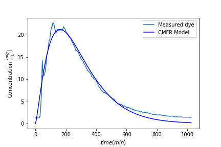

# Third-party imports
- import numpy as np
- import pandas as pd
- import matplotlib.pyplot as plt
- import matplotlib

# AIDE imports
- import aide_design
- import aide_design.pipedatabase as pipe
- from aide_design.units import unit_registry as u
- from aide_design import physchem as pc
- import aide_design.expert_inputs as exp
- import aide_design.materials_database as mat
- import aide_design.utility as ut
- import aide_design.k_value_of_reductions_utility as k
- import aide_design.pipeline_utility as pipeline
- import warnings

## Steps

```python
from aide_design.play import *
import Environmental_Processes_Analysis as EPA
import importlib
importlib.reload(EPA)

#The following file is from a CMFR
data_file_path = 'Lab5Part2(CMFR_Final).xls'
print(EPA.notes(data_file_path))

#I eliminate the beginning of the data file because this is a CMFR and the first data was taken before the dye reached the sensor.
firstrow = 50
time_data = EPA.ftime(data_file_path,firstrow,-1)
concentration_data = EPA.Column_of_data(data_file_path,firstrow,-1,1,'mg/L')
V_CMFR = 1.5*u.L
Q_CMFR = 380 * u.mL/u.min

#here we set estimates that we will use as starting values for the curve fitting
theta_guess = (V_CMFR/Q_CMFR).to(u.s)

C_bar_guess = np.max(concentration_data)

#The Solver_CMFR_N will return the initial tracer concentration, residence time, and number of reactors in series.
#This experiment was for a single reactor and so we expect N to be 1!
CMFR = EPA.Solver_CMFR_N(time_data, concentration_data, theta_guess, C_bar_guess)
#use dot notation to get the 3 elements of the tuple that are in CMFR.
CMFR.C_bar
CMFR.N
CMFR.theta
#create a model curve given the curve fit parameters.
#
CMFR_model = CMFR.C_bar * EPA.E_CMFR_N(time_data/CMFR.theta,CMFR.N)
plt.plot(time_data.to(u.min), concentration_data.to(u.mg/u.L),'r')
plt.plot(time_data.to(u.min), CMFR_model,'b')

plt.xlabel(r'$time (min)$')
plt.ylabel(r'Concentration $\left ( \frac{mg}{L} \right )$')
plt.legend(['Measured dye','CMFR Model'])

plt.savefig('images/reactorplot.png')
plt.show()

#Load a data file for a reactor with baffles. This was from a test that used acid as the tracer.
#The concentration units are moles/L

data_file_path = 'Advection_dispersion.txt'
firstrow = 0
time_data = EPA.ftime(data_file_path,firstrow,-1)
concentration_data = EPA.Column_of_data(data_file_path,firstrow,-1,1,'mole/L')
V_CMFR = 1.5*u.L
Q_CMFR = 380 * u.mL/u.min
theta_guess = (V_CMFR/Q_CMFR).to(u.s)
theta_guess
C_bar_guess = np.max(concentration_data)

#use solver to get the CMFR parameters
CMFR = EPA.Solver_CMFR_N(time_data, concentration_data, theta_guess, C_bar_guess)
CMFR.C_bar
CMFR.N
CMFR.theta.to(u.min)
#Create the CMFR model curve based on the solver parameters
#We do this with dimensions so that we can plot both models and the data on the same graph. If we did this in dimensionless it wouldn't be possible to plot everything on the same plot because the values used to create dimensionless time and dimensionless concentration are different for the two models.
CMFR_model = (CMFR.C_bar*EPA.E_CMFR_N(time_data/CMFR.theta, CMFR.N)).to(u.mole/u.L)

#use solver to get the advection dispersion parameters
AD = EPA.Solver_AD_Pe(time_data, concentration_data, theta_guess, C_bar_guess)
AD.C_bar
AD.Pe
AD.theta.to(u.min)
#Create the advection dispersion model curve based on the solver parameters
AD_model = (AD.C_bar*EPA.E_Advective_Dispersion((time_data/AD.theta).to_base_units(), AD.Pe)).to(u.mole/u.L)

#Plot the data and the two model curves.
plt.plot(time_data.to(u.min), concentration_data.to(u.mole/u.L),'-')
plt.plot(time_data.to(u.min), CMFR_model,'b')
plt.plot(time_data.to(u.min), AD_model,'g')
plt.xlabel(r'$time (min)$')
plt.ylabel(r'Concentration $\left ( \frac{mg}{L} \right )$')
plt.legend(['Measured dye','CMFR Model', 'AD Model'])

plt.savefig('images/reactorplot.png')
plt.show()

```

